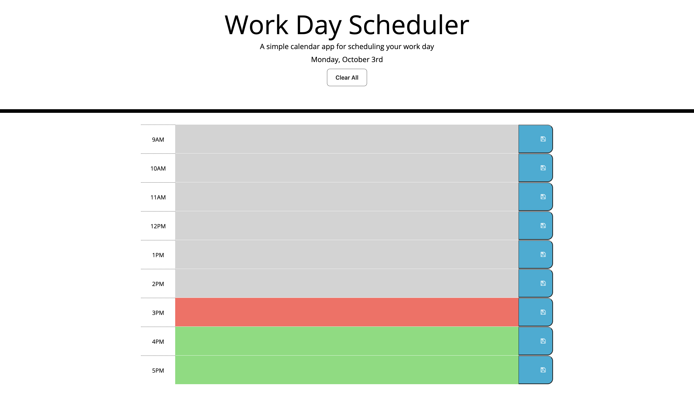

# Coding Bootcamp Week 5 Challenge - Work Day Scheduler

## Description

This week, I was challenged to create a single day work planner that save all inputs and colour codes every row depending on what time it is (grey for past, red for present and green for future). The current date is also displayed at the top of the webpage for convenience.

## Built With

* HTML
* CSS
* JavaScript
* Bootstrap
* Jquery

## Usage

To access this webpage, follow the link below and view the webpage, add some text into one of the time slots, click the save button to the right and refresh to see the saved text still there!

Below is the link to the webpage

https://brodie02.github.io/bootcamp-challenge5/

## Credits

Made by [Brodie Marshall](https://github.com/brodie02)

---